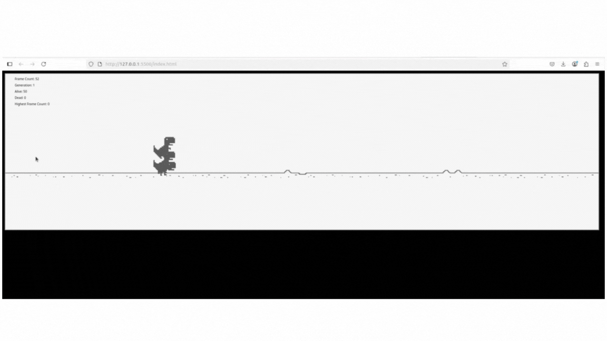

# 🦖 Dino Evolution AI

A browser-based, self-learning Dino game where AI-controlled dinosaurs learn to avoid obstacles using a **Genetic Algorithm (GA)** and **Neural Networks**. Inspired by the classic Chrome Dino game, this version evolves its players over generations—no human input required.

---

## 🚀 Features

- AI dinos make decisions with a neural network (jump, duck, or do nothing)
- Genetic Algorithm to evolve behavior over generations:
  - Fitness-based selection
  - Crossover between parents neural network parameters
  - Random mutation of child neural network parameters
- Dynamic obstacle generation (cacti and pterodactyls), ground scrolling animation and live stats display
- Evolution starts automatically when all dinos are dead

---

## 🧠 How It Works

The game initializes a population of dinos (each with a neural network initialized with random weights and biases).  
Each dino operates independently. On every frame:

- It observes the environment (speed, obstacle distance, etc.)
- Feeds this information into its neural network
- Selects an action based on the network's output:
  - `0` → Do nothing
  - `1` → Duck
  - `2` → Jump

The network uses a softmax layer to select the most probable action.

---

## Files

`script.js` - Main javascript integrating game world with evolutionary aglorithm.
`assets.js` - Implementation of game world components.
`actions.js` - Interface for executing actions guided by the neural network AFK.
`evolution.js` - Genetic algorithm implementation (includes mutation and crossover methods).